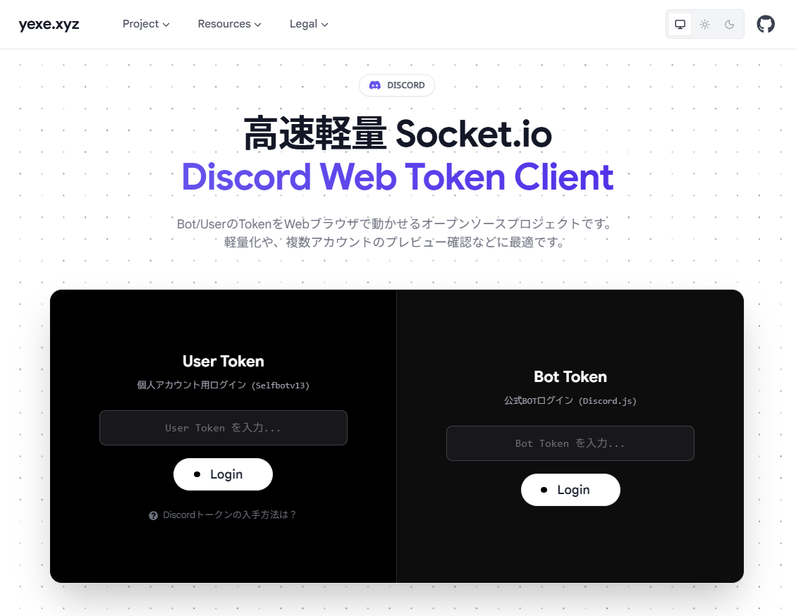
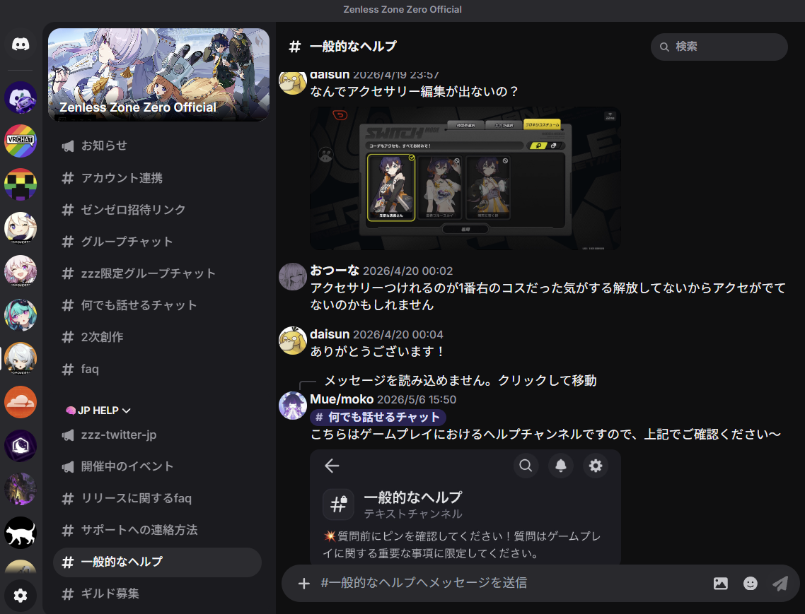

<div align="center">
<h1>
  Discord Web Token Client
  
  [](.)
  [](./frontend)
  [](./backend)
  [](LICENSE)
</h1>
Socket.io と discord.js-selfbot を使用した、WEB 上のオリジナル Discord クライアント!<br>
Bot トークンおよびユーザー個人トークンにも一応対応しています。<br>
<br>

<table>
  <tr>
    <td align="center" width="50%">
      
      <br>
      <sub>ログイン画面</sub>
    </td>
    <td align="center" width="50%">
      
      <br>
      <sub>アプリ画面(Web)</sub>
    </td>
  </tr>
</table>
</div>
<br/>

## なんのためにつくった...?

フィルタリング回避が主な目的ではあるが、  
ついでに超重いWeb版Discordをどうにかしたかったのと、Web版でBotClientを使えるようにしたかった等...  
基本使う必要ないサイトだと思います。自分用。


## 特徴など...

- **高速・軽量**: Socket.io によるリアルタイム通信
- **マルチデバイス**: PC およびスマホ表示対応
- **多機能対応**: DM/グループDM/フォーラム/スレッド 等にも対応
- **メッセージ操作**: 返信、リアクションなどに対応

- **非対応**: VC/コマンド等は今後対応予定... 私用サイトですがよければPullください


## ディレクトリ構造

```
/frontend  React(Vite) + Tailwind CSS (ほぼMaterial3Expressive)
/backend   Node.js + Express + Socket.io
```

## 免責事項

このプロジェクトにはセルフボットを利用しております。
> [!WARNING]
> 本プロジェクトでユーザー名義のトークンを使用することは、Discord 公式のサービス利用規約に違反する可能性があります。
> 本サービスの利用によりアカウントが停止、削除、または制限された場合でも、開発者は一切の責任を負いません。
> すべて自己責任において利用してください。

## ライセンス

[AGPL-3.0](LICENSE)  
改変した後、ネットワーク経由でユーザーにサービスを提供する場合、ソースコードの公開義務が発生します。

© 2026 yexe.xyz